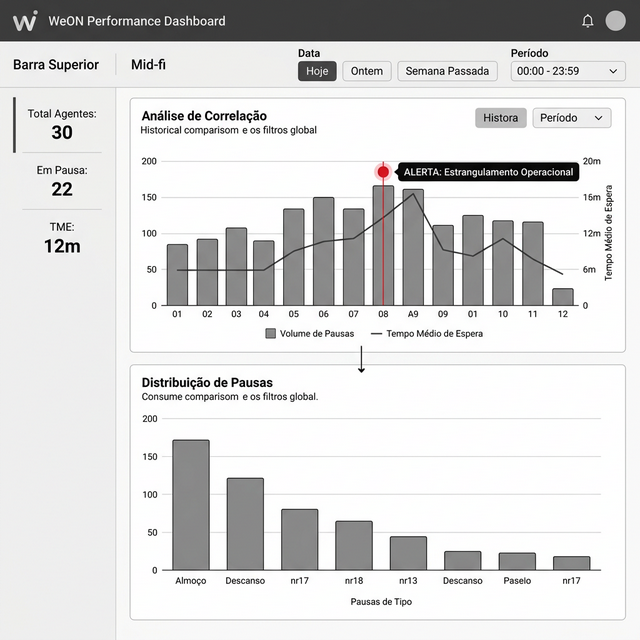

# Funcionalidade 01 - Gráfico de Distribuição de Pausas

## 🎯 Objetivo
Fornecer uma representação visual das pausas dos agentes ao longo de um dia/período específico, detalhada por hora. Esta ferramenta é essencial para a análise de **Aderência (Adherence)** em Workforce Management (WFM).

> [!NOTE]
> Veja o [Contexto de WFM](03_Contexto_Workforce_Management.md) para entender a importância estratégica desta métrica.

## 📋 Requisitos

### 1. Requisitos Funcionais
* **Tipo de Gráfico:** Gráfico de Barras (Distribuição Horária).
* **Métricas:**
    * **Volume de Pausas:** Número total de eventos de pausa iniciados em cada hora.
    * **Duração de Pausas:** Duração total ou média das pausas dentro de cada hora.
* **Granularidade:** Intervalos de 30 ou 60 minutos (mantendo a consistência com os gráficos existentes).
* **Interações:**
    * **Hover (Passar o mouse):** Exibir o total de ocorrências de pausa e a duração total para o intervalo específico.
    * **Filtragem Sincronizada:** Deve obrigatoriamente consumir o mesmo filtro de Data e Hora da 'Análise de Correlação'. Qualquer alteração no filtro impacta ambos os gráficos simultaneamente.
* **Visão Histórica:** O usuário deve ser capaz de selecionar períodos passados (ex: 'Semana Passada', 'Últimos 30 dias') para analisar o comportamento histórico das pausas.

### 2. Requisitos de Design
* **Esquema de Cores:** Usar cores semânticas distintas para pausas (ex: tons de Laranja ou Amarelo) para diferenciar das métricas de "Atendido" (Verde) ou "Abandono" (Vermelho).
* **Layout:** Posicionar este gráfico obrigatoriamente **abaixo** do gráfico de "Análise de Correlação".

## 🖼️ Wireframe (Média Fidelidade - Dashboard Unificado)

*Nota: Este gráfico compartilha o mesmo filtro de Data/Hora e está posicionado abaixo da 'Análise de Correlação'.*

## 🧪 Critérios de Aceite
- [ ] O usuário consegue ver quantas pausas ocorreram entre 08h e 09h.
- [ ] O usuário consegue ver a duração total gasta em pausa durante essa hora.
- [ ] O gráfico é atualizado quando o filtro de data é alterado.
